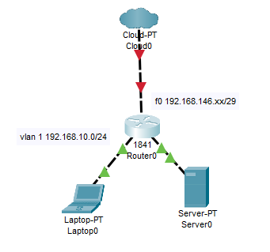

# サーバー構築実習（CentOS7）

## Proxyサーバ構築

| 機器 | IPアドレス |
| --- | --- |
| fo | 192.168.146.xx/29 |
| vlan 1 | 192.168.10.254/24 |
| クライアントPC | 192.168.10.3(or 8) |
| Squidサーバ(Windows) | 192.168.10.1 |
| Squidサーバ(centOS) | 192.168.10.2 |



```shell
(Router)
int f0
    ip add 192.168.146.xx 255.255.255.248
    no sh
!
int vlan 1
    ip add 192.168.10.0 255.255.255.0
    no sh
!

ip route 0.0.0.0 0.0.0.0 192.168.146.xx+5
```

```shell
(Router)
int f0
    ip nat outside
!
int vlan 1
    ip nat inside
!
access-list 1 permit host 192.168.10.2
ip nat inside source list 1 int f0 overload
```

### プロキシとは

自宅や会社でインターネットへのアクセスを制限したい場合、`「プロキシサーバ」`を構築する。プロキシ(Proxy)とは、英語で`代理`という意味である。LAN内のコンピュータやネットワーク機器がインターネットに直接アクセスできない環境では、インターネットへのアクセスを許可するためにプロキシサーバを設置する。プロキシサーバがそれらに代わってインターネットにアクセスし、その応答をアクセス元に返す仕組みになっている。また、プロキシサーバは、アクセスしたデータを一時的に保持する`「キャッシュ」`機能を備えており、キャッシュしたデータがあれば、インターネットへのアクセスが不要になり、Webページを閲覧することができます。インターネットへのアクセス量が減り、サーバに負荷を軽減させます。

## １．Proxyサーバ（Squid）の導入
### squidのインストール

```shell
[root@localhost ~]# yum -y install squid
```

### squid.confの設定

```shell
[root@localhost ~]# vim /etc/squid/squid.conf
```

以下の内容を変更および追加

- コメントアウト
    - #acl localnet src 10.0.0.0/8    # RFC1918 possible internal network
    - #acl localnet src 172.16.0.0/12 # RFC1918 possible internal network
    - #acl localnet src 192.168.0.0/16        # RFC1918 possible internal network

- 追加(192.168.10.1 ~ 10.7の計7台)
    - acl localnet src 192.168.10.0/29

- コメントアウト
    - #http_port 3128

- 追加
 - http_port 8080

```shell
#
# Recommended minimum configuration:
#

# Example rule allowing access from your local networks.
# Adapt to list your (internal) IP networks from where browsing
# should be allowed
#acl localnet src 10.0.0.0/8    # RFC1918 possible internal network
#acl localnet src 172.16.0.0/12 # RFC1918 possible internal network
#acl localnet src 192.168.0.0/16        # RFC1918 possible internal network
acl localnet src 192.168.10.0/29
acl localnet src fc00::/7       # RFC 4193 local private network range
acl localnet src fe80::/10      # RFC 4291 link-local (directly plugged) machines

/* 省略 */

# Squid normally listens to port 3128
#http_port 3128
http_port 8080
```

### Proxyサービスの起動

```shell
[root@localhost ~]# systemctl start squid.service
```

### Proxyサービスの自動起動の有効化

```shell
[root@localhost ~]# systemctl enable squid.service
```

### ファイアウォールの設定

```shell
[root@localhost ~]# firewall-cmd --add-port=8080/tcp --zone=public --permanent
```

```shell
[root@localhost ~]# firewall-cmd --reload
```

### 動作確認

クライアントPCのプロキシサーバの設定を以下にする。

| アドレス | ポート |
| --- | --- |
| 192.168.10.3(or 8) | 15080 |

Webブラウザでインターネットによる検索を行う。
プロキシサーバ経由でしかアクセスできないようになっている。

## ２．Squidでアクセス制限

### アクセス禁止サイトを設定

Squidでは、特定のサイトへのアクセスを制限することができる。アクセスを禁止するサイトのドメイン名やドメイン付きホスト名の一覧を記したブラックリストファイルを作成することで、そのファイルを参照して、アクセスを禁止する。

- テキストファイルを作成

```shell
[root@localhost ~]# vim /etc/squid/blacklist.txt
```

- Yahoo!のサイトを表記

```
www.yahoo.co.jp
```

### squid.confの設定

```shell
[root@localhost ~]# vim /etc/squid/squid.conf
```

以下の内容を追加

- acl BLACKLIST dstdomain "/etc/squid/blacklist.txt"

- http_access deny BLACKLIST

```shell
#acl localnet src 172.16.0.0/12 # RFC1918 possible internal network
#acl localnet src 192.168.0.0/16        # RFC1918 possible internal network
acl BLACKLIST dstdomain "/etc/squid/blacklist.txt"
acl localnet src 192.168.10.0/29
acl localnet src fc00::/7       # RFC 4193 local private network range
acl localnet src fe80::/10      # RFC 4291 link-local (directly plugged) machines

/* 省略 */


# Recommended minimum Access Permission configuration:
#
# Deny requests to certain unsafe ports
http_access deny BLACKLIST
http_access deny !Safe_ports
```

### Proxyサービスの再起動

```shell
[root@localhost ~]# systemctl restart squid.service
```

### 動作確認

Yahooのサイトを検索する。
